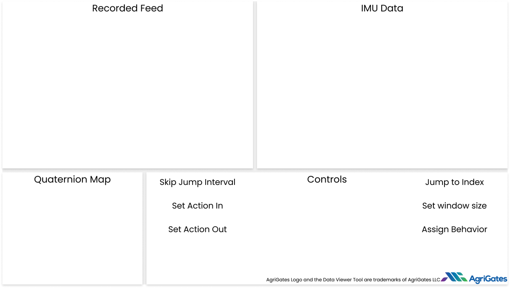

# Python Data Viewer
This first build of the data viewer is for internal bug testing from the Agrigates Team. This version of the data viewer does not have any installer prepared so a little preparation will need to be done before operation is possible. Please do the following:
## Folder Setup
The data tool requires several folders/files to operate, please setup as follows
```
data tool/
    appData/
        actions.json
    parsed data/
        exampleData.csv
        {any other csv files}
    video/
        YYYYMMDD/
            HH/
                MM.mp4
    dataToolAlpha1.0.exe {dataToolAlpha1.0.x86_64}
```

## Operation
When the application is run, it will open a file explorer dialog, navigate to the CSV file that you would like to view and press `Open`. The data tool should now open and look like the following:

If this is seen, you are ready to test the data viewer!

## Controls
### Play/Pause - play or pause the video/data


### Forward/Backward Button - moves video and data feed forward/backward by one entry


### Skip Forward/Backward Button - moves the video and data feed forward/backward by `Skip Jump Interval`


### Set Action In - sets the beginning timestamp of the current observed action to the current index (rightmost portion of the data graph)


### Set Action Out - sets the end timestamp of the current observed action to the current index (rightmost portion of the data graph)


### Check Boxes - allows for manual control of intervals/window settings/navigation/action exporting/etc


## Operation
To use the data tool all you need to do is:
- Use the play/pause/skip buttons to navigate to the start of an action that you want to label
- Press the Set Action In Button
- Use the controls to navigate to the end of the observed action
- Press the Set Action Out Button
- Choose the desired action from the actions drop down menu
- Press the check box to the right of the drop down
- Rinse and repeat!

## Changing plots
If you want to change plots, you can use the `Plot` dropdown at the top of the tool and select from either the preset options on the top `Acceleration, Magnetometer, Gyro, ...` to change the plots to the (W),X,Y,Z components of that plot type. Or you can use the bottom options to set custom plots. If you want to see only X components you can choose the X components of individual plots in their respective sub-menus.

## Narrowing Scrollbar
if you would like to narrow down the scrollbar to have finer controls. Please use the menu Scrollbar -> Set Edges... option, this will give you a secondary GUI for entering the start and stop indexes that you would like the scrollbar to be between.

## Common Errors
### After opening a csv file, the tool crashes without showing any data
Please make sure that the `appData` folder exists and that the `actions.json` file is in that folder.
#### actions.json
```json
{
    "actions": [
        "Test Action 1",
        "Test Action 2"
    ],
    "labeledData": [
        {
            "actionTimeIn": "2023-09-12T16:23:40.511Z",
            "actionTimeOut": "2023-09-12T16:23:51.233Z",
            "actionType": "eating",
            "file": "Big_Blue.csv"
        },
        {
            "actionTimeIn": "2023-09-12T17:01:51.511Z",
            "actionTimeOut": "2023-09-12T17:02:15.233Z",
            "actionType": "sleeping",
            "file": "Big_Orange.csv"
        }
    ]
}
```

### How do I set more actions/change the current actions?
Please open the `appData/actions.json` file and add any actions you want as the following:
```json
{
    "actions": [
        "Action 1",
        "Action 2",
        ...
        "Action n"
    ],
...
```

### I can only see a `Media could not be found` error
Please ensure that the video folder/sub-folder structure is formatted as specified as:
```
data tool/
    appData/
        actions.json
    parsed data/
        exampleData.csv
        {any other csv files}
    video/
        YYYYMMDD/
            HH/
                MM.mp4
    dataToolAlpha1.0.exe {dataToolAlpha1.0.x86_64}
```