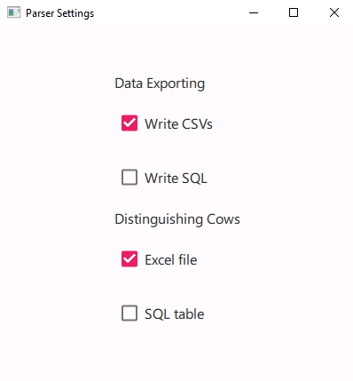
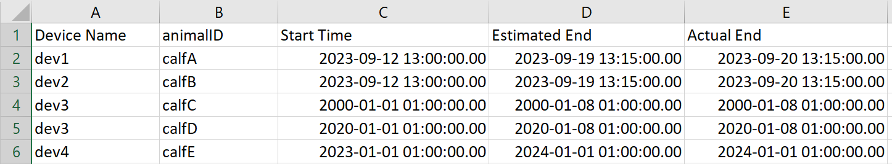
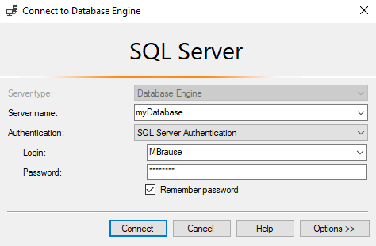
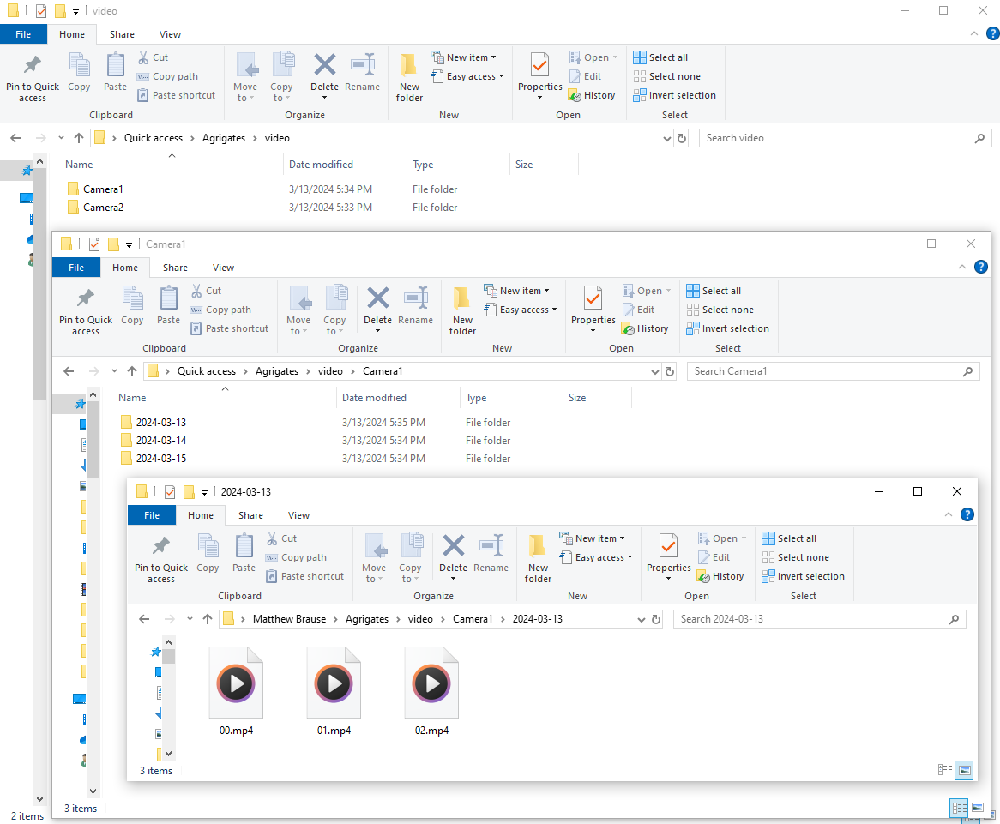
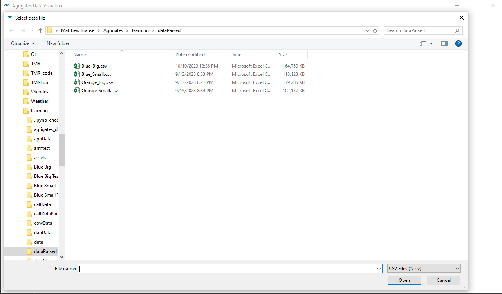
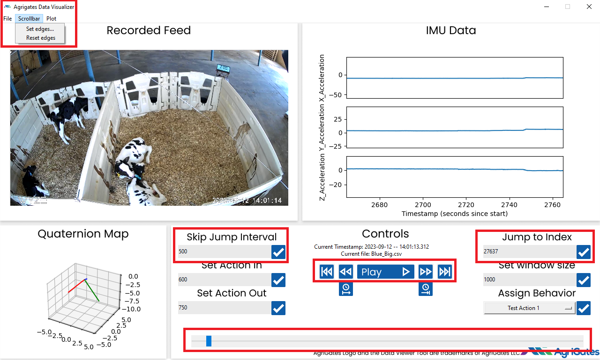
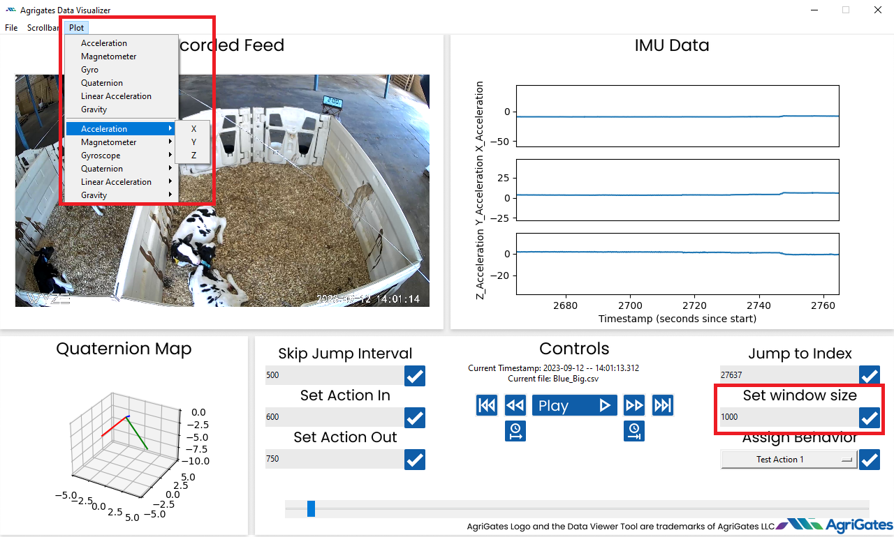
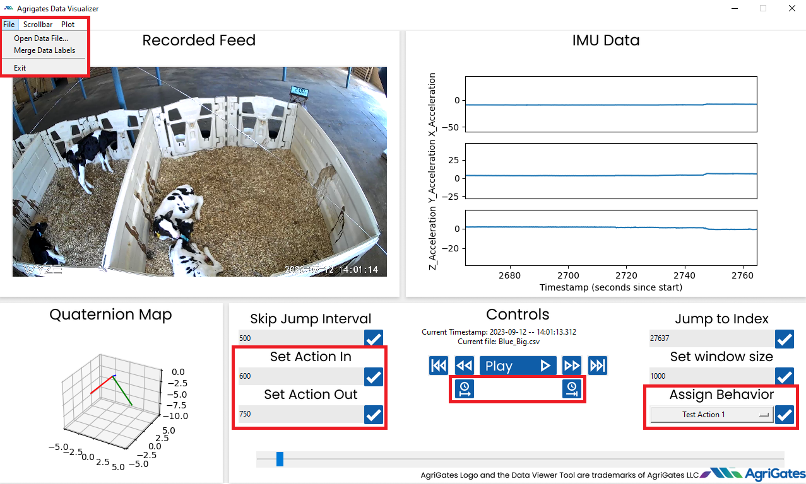

[Data Annotation Tool](./DataAnnotationToolPython/pythonDataTool.md)

# AgTag User Manual

---

## Contents
- [Sensor](#sensor)
- [Edge](#edge)
- [Parser](#parser)
- [Annotation](#annotation)

---

## Sensor

---

## Edge

---
<!--
Honestly this parser stuff could just be the last part of edge
--- -->
## Parser

### Walkthrough of Process

The Parser is monitoring the output folder that the sensors dump data into. When it detects a new file, it parses the raw data into human readable data. 
It then groups the data based on the animal that the device was on using a user managed table. Finally it writes out the parsed data to the user's chosen location. 

### Setup

The Parser and source file directories will already be set up on the Edge. The user only needs to manage the settings and potential SQL connection. 
To do this, boot up ParserSettings.exe and this window will open:

By default the parser is only writing to local CSVs, and is reading the device to animal conversion information from a local excel file. Both of these require the user to 
repeatedly return to the edge to both retrieve data, and update the excel conversion. The excel table looks like:

If the user desires to do this in the cloud, they can export the data to SQL tables, 
and read the device to animal conversion from a SQL table. 

### Management

The ParserManagement.exe handles connecting to SQL from the user's end, managing the device naming, managing the device to animal conversion table, and extracting the data into csvs. There will be 4 tabs, one for each process. 
(Note these are all stand-ins while we develop this UI)

#### SQL Connection
First, the SQL connection tab will look like:

The credentials will get saved in an encrypted file so as to facilitate future logins.

#### UUID to Device Name

The device naming tab will look like: 

For each of the devices, the user can assign a device name for easy of understanding in other processes. It is a lot easier to remember Device1 rather than 5330CBBD60ED

#### Animal Conversion

The animal conversion will look like: 

Here the user selects a decive name, pairs it to an animal ID, and selects the time range that the device will be on the animal. Once the device is actually removed from the animal the user should update the "Actual End" boxes. 

#### CSV Extraction

And the extract selection will look like:

The user can select an animal, and a time range, to download a csv of that data from the SQL table. The user can also use the download all feature to either download all the data within a time range, or simply download all the data. 
It should be noted that there will be a lot of data and downloading all of it may take time.

---

## Annotation

### Setup

The video camera footage needs to follow a specific file hierarchy. It should follow:

Video/CameraX/Date/hour.mp4

### Startup

The annotation software is used to view graphs of the data next to video of the animals creating the data for the purpose of annotating the animals' behaviors. On startup of the software the user is prompted to select the data they wish to annotate. 

### Moving Around

To move the data around, the user has many different tools. 

Primarily there is a scrollbar at the bottom to scroll through the entirety of the data. Due to the large amount of data, the scrollbar does not have high precision, 
therefore there are scrollbar controls in a tab in the top left menu bar. Here the user can set bounds on the scrollbar to give it more precision. The user can also always jump to a specific time in the data using the "Jump to" box. 
(NOTE FOR TEAM BEFORE SHIPPING OFF!!! DO WE WANT TO SAY HERE - "Note this will be changed to a time entry rather than an index entry on release") 
Furthermore in the center there are buttons for precise controls as well. The play button plays the video and moves the graph according at real speed. To the left and right of the play button are buttons to move backwards and forwards one frame. 
The last set of buttons on the outside move forwards and backwards a number of seconds specified by the user in the "Skip Jump Interval" box. 

### Viewing the Data

There are a few controls based around the graph. 

By default, the tool is graphing out the X-Y-Z Acceleration. In the top menu bar, we can change these plots to be other preprogrammed sets of data, or create the user's own custom set to graph. 
The user can also change the amount of data being graphed by editing the "Set window size" box. 

### Annotating

There are a few ways the user can annotate the data as well. 

In the top menu bar, the file that we are annotating can be changed. The user can type in specific start and end times in the "Set Action In" and "Set Action Out" boxes. Alternatively the user can use the buttons in the middle, the left button sets the current time in the video/graph to the action start time, and the right button sets the current time to the action end time. To finish the annotation the user assigns a behavior and presses the check next to the behavior to log the annotation. After logging many annotations the user can press the "Merge Data Labels" option in the file top menu bar to append the annotated behaviors to the current file. This does not need to be done in one sitting, as the logged behaviors are saved separately. 

